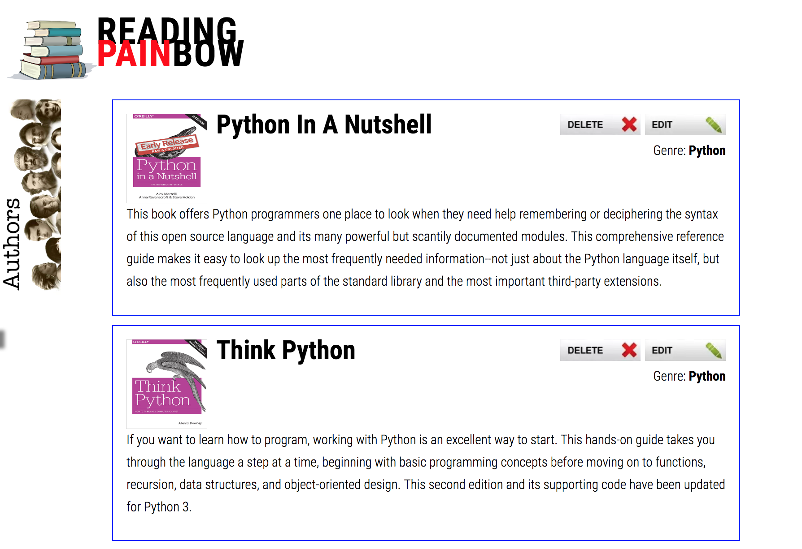

# ReadingPainbow
* an api-generated library where dynamically-listed books/authors can be created/deleted/edited in full CRUD capability

* CRUD compatible 
1. create = /post
1. read = /get
1. update = /put
1. delete = /delete

## Splash page

<kbd></kbd>
